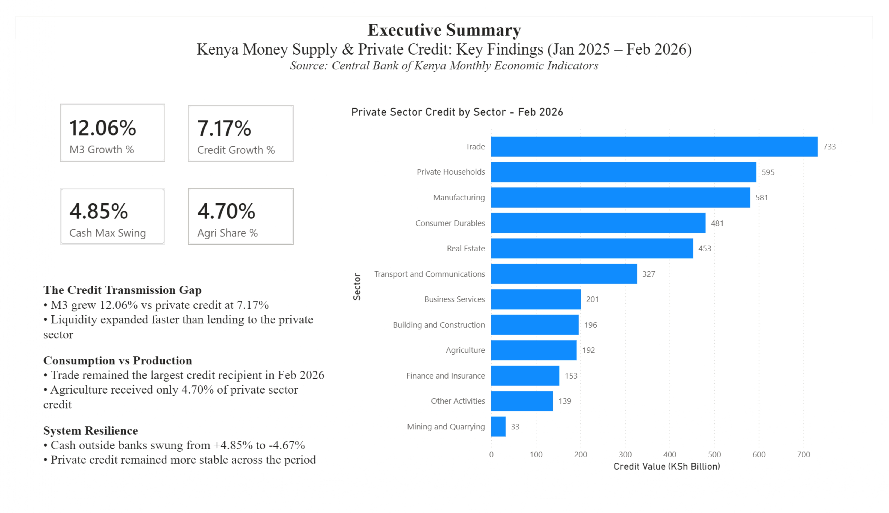
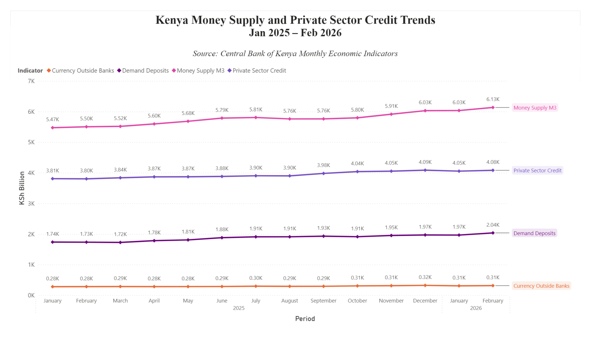
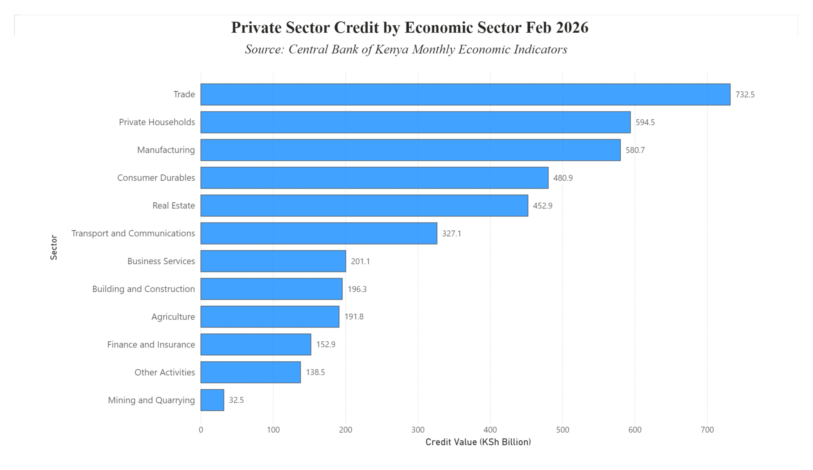
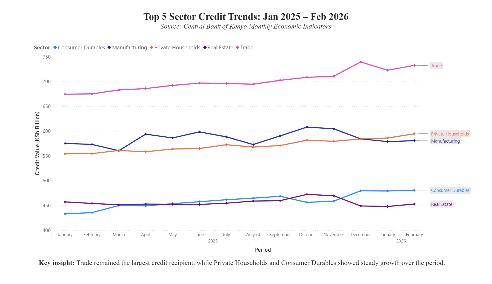
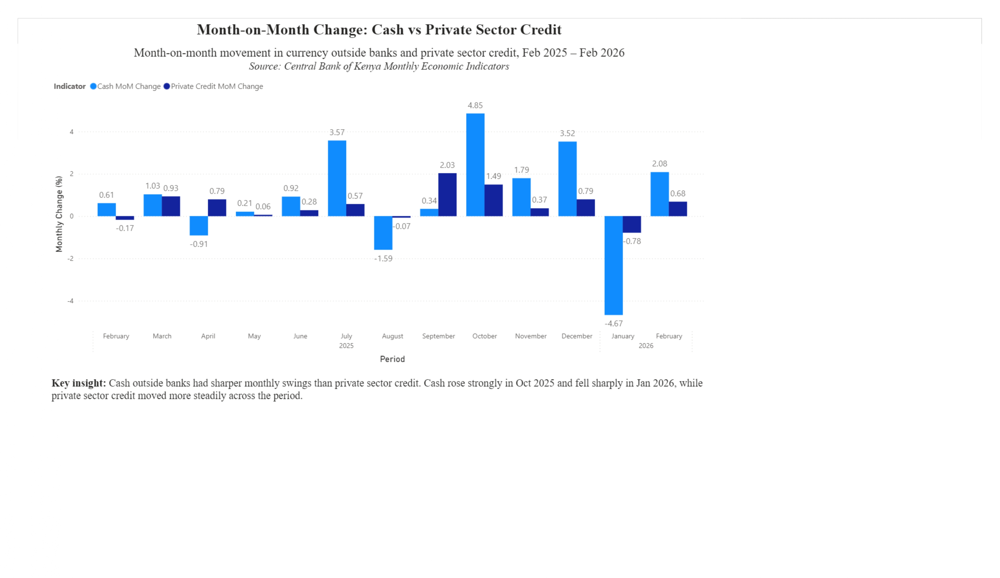

# Kenya Money Supply and Private Sector Credit Dashboard

## Project Overview

This Power BI project analyzes Kenya’s money supply and private sector credit trends from **January 2025 to February 2026** using data from the **Central Bank of Kenya Monthly Economic Indicators**.

The dashboard investigates whether Kenya’s growth in broad money supply is translating into private sector credit growth, which sectors receive the most credit, and whether cash movement is more volatile than bank lending.

This project was built as a business intelligence and data analytics portfolio project.

---

## Dashboard Preview

### Executive Summary



### Money Supply and Private Credit Overview



### Sector Credit Analysis



### Sector Credit Trends



### Monthly Change Analysis



---

## Main Business Question

**Is Kenya’s growth in money supply translating into stronger private sector credit between January 2025 and February 2026?**

---

## Key Questions Answered

### 1. Macro Health Check

- Is Kenya’s broad money supply growing, shrinking, or stagnant?
- Is money supply growth translating into actual loans to businesses and households?
- Is private sector credit growing at the same pace as money supply?
- Is there a possible gap between liquidity growth and credit growth?

### 2. Money Composition

- Is the money movement coming from cash outside banks or bank deposits?
- How large is currency outside banks compared to total money supply?
- Are cash movements stable or volatile?
- Do demand deposits show stronger growth than physical cash?

### 3. Sector Credit Allocation

- Which economic sectors receive the most private sector credit?
- Which sectors receive the least credit?
- Is credit concentrated in a few sectors or spread evenly across the economy?
- How much credit goes to agriculture compared to sectors like trade, households, manufacturing, and real estate?

### 4. Credit Stability and Volatility

- Which is more volatile: cash outside banks or private sector credit?
- Did the sharp cash decline in January 2026 lead to a major decline in private sector credit?
- Does private sector credit remain stable even when cash outside banks changes sharply?

### 5. Decision-Making Insight

- What does the gap between money supply growth and private sector credit growth suggest?
- Which sectors may require closer policy or investment attention?
- What should banks, investors, and policymakers monitor?

---

## Time Period Covered

**January 2025 – February 2026**

For month-on-month change analysis, the period starts from **February 2025** because month-on-month change requires a previous month for comparison.

---

## Data Source

The data was sourced from:

**Central Bank of Kenya — Monthly Economic Indicators**

Files used:

- Monthly Economic Indicators — January 2026
- Monthly Economic Indicators — February 2026

The project uses selected indicators from the CBK money, credit, and interest rate tables.

---

## Metrics Used

| Metric | Meaning |
|---|---|
| Money Supply M3 | Broad measure of money supply in the economy |
| Private Sector Credit | Credit extended to private businesses and households |
| Currency Outside Banks | Physical cash held outside the banking system |
| Demand Deposits | Money held in bank accounts that can be accessed quickly |
| Cash MoM Change % | Month-on-month change in currency outside banks |
| Private Credit MoM Change % | Month-on-month change in private sector credit |
| Sector Credit Value | Private sector credit by economic sector |
| M3 Growth % | Total growth in money supply over the period |
| Private Credit Growth % | Total growth in private sector credit over the period |
| Agriculture Share % | Agriculture’s share of total private sector credit |
| Cash Max MoM Swing | Largest monthly increase in cash outside banks |

---

## Dashboard Pages

### 1. Executive Summary

This page gives a high-level summary of the dashboard findings.

It includes:

- M3 total growth
- Private sector credit growth
- Peak cash volatility
- Agriculture’s share of private sector credit
- Top private sector credit recipients
- Key written insights

Main insight:

> Money supply grew faster than private sector credit, suggesting that liquidity expanded faster than lending to the private sector.

---

### 2. Overview

This page shows the trend of key money and credit indicators from January 2025 to February 2026.

Metrics shown:

- Money Supply M3
- Private Sector Credit
- Demand Deposits
- Currency Outside Banks

Main insight:

> Money Supply M3 increased steadily over the period. Private sector credit also increased, but at a slower pace than overall money supply.

---

### 3. Sector Credit Analysis

This page ranks private sector credit by economic sector for February 2026.

Sectors analyzed include:

- Trade
- Private Households
- Manufacturing
- Consumer Durables
- Real Estate
- Transport and Communications
- Business Services
- Building and Construction
- Agriculture
- Finance and Insurance
- Other Activities
- Mining and Quarrying

Main insight:

> Trade received the highest amount of private sector credit in February 2026, while Mining and Quarrying received the lowest.

---

### 4. Sector Credit Trends

This page tracks the top five credit-receiving sectors from January 2025 to February 2026.

Top sectors shown:

- Trade
- Private Households
- Manufacturing
- Consumer Durables
- Real Estate

Main insight:

> Trade remained the largest credit recipient throughout the period. Private Households and Consumer Durables showed steady growth, while Real Estate remained relatively stable.

---

### 5. Monthly Change Analysis

This page compares monthly changes in cash outside banks and private sector credit.

Metrics shown:

- Cash MoM Change %
- Private Credit MoM Change %

Main insight:

> Cash outside banks showed sharper monthly swings than private sector credit. Private sector credit remained more stable even when cash movement changed sharply.

---

## Key Findings

1. **Money Supply M3 increased by 12.06%** between January 2025 and February 2026.

2. **Private sector credit increased by 7.17%** over the same period.

3. **Money supply grew faster than private sector credit**, suggesting a possible credit transmission gap.

4. **Trade was the largest private sector credit recipient** in February 2026.

5. **Agriculture received only 4.70% of private sector credit**, despite its importance to Kenya’s economy.

6. **Cash outside banks was more volatile than private sector credit**, with the strongest increase occurring in October 2025 and the sharpest decline occurring in January 2026.

7. **Private sector credit remained relatively stable**, even when cash outside banks declined sharply.

---

## Tools Used

| Tool | Purpose |
|---|---|
| Microsoft Excel / LibreOffice Calc | Data cleaning and table preparation |
| Power BI Desktop | Dashboard creation and visualization |
| Power Query | Data transformation |
| DAX | Measures and calculated insights |
| GitHub | Project documentation and portfolio hosting |

---

## Data Preparation Process

The original CBK data was arranged in a wide spreadsheet format:

```text
Indicator | Jan-25 | Feb-25 | Mar-25 | ...
```

This format is easy to read in Excel, but it is not ideal for Power BI analysis.

For Power BI, the data was transformed into long format:

```text
Date | Indicator | Value | Unit | Category
```

This made it easier to build:

- Line charts
- Filters
- Sector comparisons
- Time-series analysis
- DAX measures
- Executive summary KPIs

---

## Data Model

The project uses two main tables.

### PowerBI_Data

This table contains monthly money supply and private credit indicators.

Columns:

```text
Date
Indicator
Value
Unit
Category
```

Example indicators:

- Money Supply M3
- Currency Outside Banks
- Demand Deposits
- Private Sector Credit
- Cash MoM Change
- Private Credit MoM Change
- Cash as % of M3
- Cash as % of Liquid Money

---

### Sector_Credit_Data

This table contains private sector credit by economic sector.

Columns:

```text
Date
Sector
Credit_Value
Unit
Category
```

Example sectors:

- Agriculture
- Manufacturing
- Trade
- Building and Construction
- Transport and Communications
- Finance and Insurance
- Real Estate
- Mining and Quarrying
- Private Households
- Consumer Durables
- Business Services
- Other Activities

---

## DAX Measures Created

The Executive Summary page uses DAX measures to calculate high-level indicators.

Examples:

```DAX
M3 Growth %
Credit Growth %
Cash Max Swing
Agri Share %
```

These measures help summarize:

- Total money supply growth
- Total private sector credit growth
- Maximum monthly cash movement
- Agriculture’s share of total private sector credit

---

## Dashboard Insights by Page

| Page | Main Question | Main Insight |
|---|---|---|
| Executive Summary | What are the key findings? | M3 grew faster than private credit |
| Overview | Are money and credit growing? | Both grew, but M3 grew faster |
| Sector Credit Analysis | Who receives the most credit? | Trade received the highest credit |
| Sector Credit Trends | How did top sectors change over time? | Trade remained dominant |
| Monthly Change Analysis | Which is more volatile, cash or credit? | Cash outside banks was more volatile |

---

## Skills Demonstrated

This project demonstrates the following data analytics skills:

- Data cleaning
- Data transformation
- Power BI dashboard design
- Power Query usage
- DAX measure creation
- Time-series analysis
- Sector-level credit analysis
- Business intelligence storytelling
- Economic data interpretation
- Executive summary reporting
- Dashboard documentation using GitHub

---

## Limitations

This dashboard is based on selected CBK Monthly Economic Indicators from January 2025 to February 2026.

Some questions require additional data before making strong policy conclusions.

For example:

- To understand where excess liquidity is going, more data on government securities, bank reserves, and government borrowing would be needed.
- To determine whether cash spikes are seasonal or unusual, more years of monthly cash data would be needed.
- To recommend interest rate policy, additional data on inflation, lending rates, Treasury bill rates, exchange rates, non-performing loans, and GDP growth would be required.
- To classify credit as productive or consumption-based, a sector grouping model would be needed.

Therefore, this dashboard should be interpreted as an exploratory business intelligence analysis, not a full macroeconomic policy model.

---

## Recommended Decision-Maker Actions

Based on the dashboard, decision-makers may consider:

1. Monitoring whether money supply growth continues to translate into private sector credit growth.

2. Investigating why private sector credit grew more slowly than broad money supply.

3. Reviewing credit allocation to agriculture and other productive sectors.

4. Tracking household and consumer-related credit growth to identify possible risk areas.

5. Comparing private sector credit growth with interest rates, government borrowing, and inflation before making policy decisions.

---

## Project Structure

```text
kenya-money-supply-private-credit-dashboard/
│
├── data/
│   └── CBK_Money_Supply_Private_Credit_Trends.xlsx
│
├── powerbi/
│   └── CBK_Money_Supply_Private_Credit_Trends.pbix
│
├── screenshots/
│   ├── executive_summary.jpg
│   ├── overview.jpg
│   ├── sector_credit_analysis.jpg
│   ├── sector_credit_trends.jpg
│   └── monthly_change_analysis.jpg
│
├── docs/
│   ├── CBK Monthly Economic Indicators Jan 2026.pdf
│   └── CBK Monthly Economic Indicators Feb 2026.pdf
│
├── LICENSE
└── README.md
```

---

## Files Included

| Folder | Contents |
|---|---|
| data | Cleaned Excel dataset used in Power BI |
| powerbi | Power BI `.pbix` dashboard file |
| screenshots | Dashboard page screenshots |
| docs | Original CBK source documents |
| README.md | Project documentation |
| LICENSE | MIT License |

---

## How to View the Project

To view the dashboard:

1. Download or clone this repository.
2. Open the `.pbix` file in **Power BI Desktop**.
3. Navigate through the dashboard pages:
   - Executive Summary
   - Overview
   - Sector Credit Analysis
   - Sector Credit Trends
   - Monthly Change Analysis

If Power BI Desktop is not installed, the screenshots in the `screenshots/` folder provide a visual preview of each page.

---

## Future Improvements

Future improvements may include:

- Adding more historical years
- Adding interest rate data
- Adding inflation data
- Adding government borrowing data
- Adding non-performing loan data
- Creating sector groups such as productive, consumption, property, and financial sectors
- Publishing the dashboard to Power BI Service
- Adding a Power BI public portfolio link

---

## Project Status

Completed.

---

## Author

**Trevor Mulundi (MastaT)**

Data Analytics and Business Intelligence Portfolio Project

---

## License

This project is licensed under the MIT License.

The dashboard and documentation are shared for learning and portfolio purposes. The original data remains credited to the Central Bank of Kenya.
